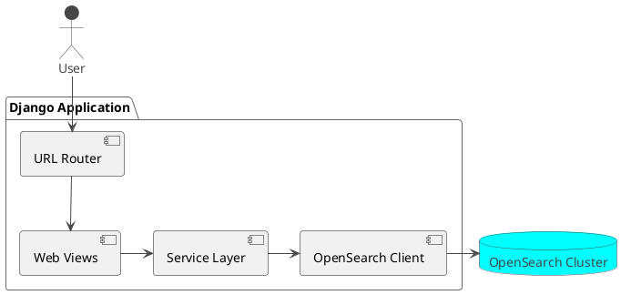

# apbs

A Django web application using OpenSearch as its primary data backend.

## Architectural Concept

This project is a Django application that bypasses a traditional relational database in favor of OpenSearch for all data persistence. The architecture is designed to leverage the strengths of OpenSearch for search and analytics-heavy workloads while using Django for its robust web framework capabilities.

### Core Concepts

*   **OpenSearch as the primary database:** All application data is stored, indexed, and queried from an OpenSearch cluster. There is no relational database like PostgreSQL or MySQL.
*   **Django for application logic:** Django manages the web server, URL routing, and business logic. It interacts with OpenSearch through a dedicated service layer.
*   **Separation of Concerns:** A clear separation is maintained between Django's web-facing components and the OpenSearch data access layer. This makes the application easier to maintain and test.

### Implementation Details

*   **`apbs.opensearch` module:** This Django app contains all the code for interacting with OpenSearch, including connection handling, indexing, and querying.
*   **Models and Mappings:** While Django models are used for structure, they do not map to database tables. Instead, OpenSearch mappings define the schema for the data.
*   **Service Layer:** A service layer abstracts the Open_search queries, providing a clean interface for the rest of the Django application to use.

### Component Diagram



## Getting Started

1.  **Install dependencies:**
    ```bash
    uv sync
    ```

2.  **Run the development server:**
    ```bash
    uv run python manage.py runserver
    ```

3.  **Run tests:**
    ```bash
    uv run python manage.py test
    ```